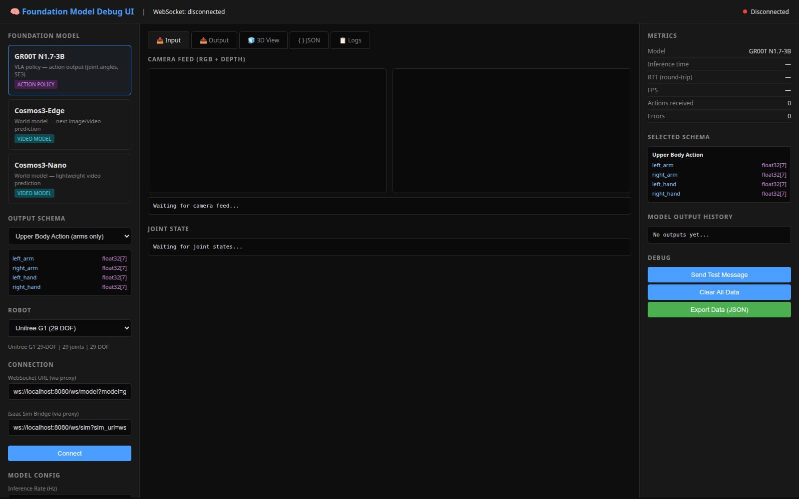

# Foundation Model Debug UI

Web UI for inspecting GR00T, Cosmos3-Edge, and Cosmos3-Nano inputs and outputs.



*Captured locally on 2026-09-24. The disconnected state is expected until the Isaac Sim and model WebSocket services are running.*

## Quick Start

```bash
# 1. Install dependencies
pip install aiohttp websockets numpy

# 2. Start the UI server
python fm_debug_ui/server.py --port 8080

# 3. Open in browser
# http://localhost:8080
```

## Architecture

```
┌──────────────────────────────────────────────────────────────────┐
│                    BROWSER (ComfyUI-style UI)                     │
│  ┌──────────────┐  ┌──────────────────┐  ┌───────────────────┐  │
│  │ Model Select │  │ Input/Output     │  │ 3D URDF View      │  │
│  │ Schema Select│  │ Camera Feed      │  │ Joint Angles      │  │
│  │ Connection   │  │ Action Output    │  │ EEF SE(3) Poses   │  │
│  └──────────────┘  └──────────────────┘  └───────────────────┘  │
└───────────────────────────┬──────────────────────────────────────┘
                            │ WebSocket
                            ▼
┌──────────────────────────────────────────────────────────────────┐
│                    UI SERVER (aiohttp, :8080)                     │
│  /ws/model → proxy to GR00T (:8765) / Cosmos (:8770/:8771)      │
│  /ws/sim   → proxy to Isaac Sim bridge (:8766)                  │
│  /api/ik   → IK solver (SE3 → joint angles)                     │
└──────────────────────────────────────────────────────────────────┘
```

## Available Models

| Model | Type | WS Endpoint | Output |
|-------|------|-------------|--------|
| GR00T N1.7-3B | Action | ws://localhost:8765 | Joint angles, SE3 |
| Cosmos3-Edge | Video | ws://localhost:8770 | Next image/video |
| Cosmos3-Nano | Video | ws://localhost:8771 | Next image/video |

## Output Schemas

- **Upper Body Action** — 14 arm joint angles
- **Full Body Action** — 29 joint angles + base commands
- **EEF SE(3)** — 6D end-effector poses
- **Joint Angles** — raw joint values
- **Next Image** — predicted RGB+depth
- **Next Video** — predicted video frames
- **Language Output** — generated text

## Connecting to Isaac Sim

Start the warehouse scene and the simulator bridge first; the browser connects
through this server's WebSocket proxies.

```bash
# Isaac Sim host / GPU container
python scripts/g1_warehouse_sim.py --wbc-mode internal --no-ira --config-dir assets/lidar_configs_rotary
python scripts/sim_ws_bridge.py --port 8766 --rate-hz 10

# Model host (for example, spark02)
python scripts/gr00t_ws_server.py --model ~/foundation_models/GR00T-N1.7-3B --port 8765
```

In the browser, the defaults are:

- Model proxy: `ws://localhost:8080/ws/model?model=gr00t`
- Simulator proxy: `ws://localhost:8080/ws/sim?sim_url=ws://localhost:8766`

The server also exposes `GET /api/models`, `GET /api/schema`,
`GET /api/robot/g1-29dof`, and `POST /api/ik`.

## Current scope

This is a debugging/inspection surface, not a safety-qualified controller.
The current 3D tab is a placeholder; live URDF/SE(3) robot rendering and
CuRobo/IK visualization are the next step. Camera panels populate only when
`sim_ws_bridge.py` receives ROS 2 camera and joint-state topics.

